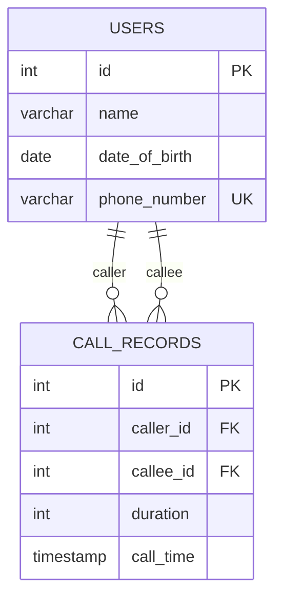

# Bài Test Vòng 1 — Lập Trình Viên Phần Mềm Web

| Field | Value |
|---|---|
| **Ứng viên** | **Nguyễn Quang Hà** |
| **Email** | hanguyxn7@gmail.com |
| **Portfolio** | [hunre.dev](https://hunre.dev) |
| **Vị trí** | Lập trình viên Phần mềm Web |
| **Tech Stack** | Vue 3 · TypeScript · Vite · Tailwind CSS · SCSS |
| **Node.js** | ≥ 18.x |

---

## Quick Start

```bash
# Clone & install
git clone <repository-url>
cd test_aime_soft
yarn install

# Start development server
yarn dev
```

> [!NOTE]
> The app runs at **http://localhost:5173** by default.

---

## Project Structure

```
test_aime_soft/
├── src/
│   ├── types/
│   │   └── index.ts                 # Shared TypeScript interfaces
│   ├── workers/
│   │   └── text-analyzer.worker.ts  # Web Worker for text processing (Bài 1)
│   ├── components/
│   │   ├── DropZone.vue             # Drag & drop file upload
│   │   ├── ResultDisplay.vue        # Word frequency results with bar charts
│   │   ├── BlockInput.vue           # Number input with validation
│   │   ├── BlockCanvas.vue          # HTML5 Canvas block/water visualization
│   │   └── WaterResult.vue          # Trapped water calculation result
│   ├── views/
│   │   ├── Bai1View.vue             # Text Analysis (Frontend)
│   │   ├── Bai2View.vue             # Trapping Rain Water (Frontend)
│   │   ├── Bai3View.vue             # Restaurant Reservation (Backend theory)
│   │   └── Bai4View.vue             # Telecom Database (Backend theory)
│   ├── router/index.ts              # Vue Router configuration
│   ├── assets/styles/
│   │   ├── main.scss                # Global styles & design tokens
│   │   └── tailwind.css             # Tailwind directives
│   ├── App.vue                      # Root component with navigation
│   ├── main.ts                      # Application entry point
│   └── env.d.ts                     # TypeScript declarations
├── index.html
├── package.json
├── tsconfig.json
├── vite.config.ts
├── tailwind.config.js
├── postcss.config.js
└── README.md
```

---

## Bài 1: Phân Tích Văn Bản (Frontend)

### Problem

Build a drag-and-drop container that reads `.txt` files and finds the **top 3 most frequent words**.

### Solution Highlights

1. **Web Worker** — Heavy text processing runs on a background thread (`text-analyzer.worker.ts`), keeping the UI completely responsive even with large files
2. **Validation pipeline** — 4-step validation: file extension → character set (regex `/^[a-zA-Z.,\s]+$/`) → tokenization → minimum 3 unique words
3. **Architecture** — Component composition: `DropZone` handles file I/O and Worker communication, `ResultDisplay` handles pure presentation with animated bar charts

### Key Implementation Details

- `FileReader` API reads the file as text
- Worker uses `Map<string, number>` for **O(n)** word counting
- Results sorted and sliced for top 3
- All state transitions (`idle` → `drag-over` → `processing` → `done`) with visual feedback

---

## Bài 2: Trapping Rain Water (Frontend)

### Problem

Given an array of non-negative integers representing block heights, calculate the trapped rainwater and visualize it.

### Algorithm

**Prefix Max approach** — O(n) time, O(n) space:

```typescript
// For each position i:
// water[i] = max(0, min(leftMax[i], rightMax[i]) - height[i])
```

Example: Input `[3, 0, 2, 0, 4]` → Output: **7 units**

### Solution Highlights

1. **HTML5 Canvas** — Custom rendering with gradient blocks, semi-transparent water, grid lines, and responsive resizing via `ResizeObserver`
2. **Real-time validation** — Input accepts only digits and commas, with instant visual feedback
3. **Reactive computation** — `computed()` properties automatically recalculate water levels when input changes

---

## Bài 3: Hệ Thống Đặt Bàn Nhà Hàng (Backend — Lý thuyết)

### Database Schema

```sql
CREATE TABLE reservations (
  id              SERIAL PRIMARY KEY,
  customer_name   VARCHAR(255) NOT NULL,
  customer_phone  VARCHAR(50) NOT NULL,
  table_number    INT NOT NULL,
  reservation_start_time TIMESTAMP NOT NULL,
  reservation_end_time   TIMESTAMP NOT NULL,
  status          VARCHAR(50) DEFAULT 'Created',
  created_at      TIMESTAMP DEFAULT CURRENT_TIMESTAMP,
  updated_at      TIMESTAMP DEFAULT CURRENT_TIMESTAMP
);
```

Status values: `Created` → `Paid` | `Canceled`

### Handling Non-overlapping Reservations

**Problem**: Race condition — two concurrent requests could both see an empty table and book it simultaneously.

**Solution**: Transaction + Pessimistic Locking (`SELECT ... FOR UPDATE`)

Overlap detection formula:

```
New reservation overlaps existing when:
  new.start < existing.end AND new.end > existing.start
```

```sql
BEGIN;

-- Lock overlapping rows to prevent concurrent bookings
SELECT * FROM reservations
WHERE table_number = :tableNumber
  AND status IN ('Created', 'Paid')
  AND reservation_start_time < :endTime
  AND reservation_end_time > :startTime
FOR UPDATE;

-- If no rows returned → safe to insert
INSERT INTO reservations (...) VALUES (...);

COMMIT;
```

### Auto-cancel After 15 Minutes

| Approach | How it works | Best for |
|---|---|---|
| **Cron Job** | Scheduled task runs every minute, batch-updates expired `Created` orders | Simple systems |
| **Lazy Evaluation** | Check expiration at query time using `CASE WHEN` | Read-heavy systems |
| **Delay Queue** | Push event to BullMQ/RabbitMQ with 15min delay | Large-scale event-driven |

Cron Job SQL:

```sql
UPDATE reservations
SET status = 'Canceled', updated_at = NOW()
WHERE status = 'Created'
  AND created_at <= NOW() - INTERVAL '15 minutes';
```

---

## Bài 4: Cơ Sở Dữ Liệu Viễn Thông (Backend — Lý thuyết)

### ERD Diagram



### DDL

```sql
CREATE TABLE users (
  id            SERIAL PRIMARY KEY,
  name          VARCHAR(255) NOT NULL,
  date_of_birth DATE NOT NULL,
  phone_number  VARCHAR(50) UNIQUE NOT NULL
);

CREATE TABLE call_records (
  id        SERIAL PRIMARY KEY,
  caller_id INT REFERENCES users(id) ON DELETE CASCADE,
  callee_id INT REFERENCES users(id) ON DELETE CASCADE,
  duration  INT NOT NULL,
  call_time TIMESTAMP NOT NULL
);
```

### Query 1: Top 3 Users by Total Outgoing Call Duration (Last Month)

```sql
SELECT u.id, u.name, u.phone_number,
       SUM(cr.duration) AS total_duration
FROM users u
INNER JOIN call_records cr ON cr.caller_id = u.id
WHERE cr.call_time >= DATE_TRUNC('month', CURRENT_DATE - INTERVAL '1 month')
  AND cr.call_time <  DATE_TRUNC('month', CURRENT_DATE)
GROUP BY u.id, u.name, u.phone_number
ORDER BY total_duration DESC
LIMIT 3;
```

**Explanation**: `DATE_TRUNC('month', ...)` gives the first day of the month. The `WHERE` clause creates a half-open interval `[first_day_last_month, first_day_this_month)` to capture exactly last month's data.

### Query 2: Users with Second-Highest Total Call Duration (Handles Ties)

```sql
WITH ranked AS (
  SELECT u.id, u.name, u.phone_number,
         SUM(cr.duration) AS total_duration,
         DENSE_RANK() OVER (ORDER BY SUM(cr.duration) DESC) AS rank
  FROM users u
  INNER JOIN call_records cr ON cr.caller_id = u.id
  WHERE cr.call_time >= DATE_TRUNC('month', CURRENT_DATE - INTERVAL '1 month')
    AND cr.call_time <  DATE_TRUNC('month', CURRENT_DATE)
  GROUP BY u.id, u.name, u.phone_number
)
SELECT id, name, phone_number, total_duration
FROM ranked
WHERE rank = 2;
```

> [!IMPORTANT]
> **Why `DENSE_RANK()` over `RANK()` or `ROW_NUMBER()`?**

| If two users tie for #1 | ROW_NUMBER | RANK | DENSE_RANK |
|---|---|---|---|
| Ranks assigned | 1, 2, 3 | 1, 1, 3 | 1, 1, **2** |
| `WHERE rank = 2` returns | Wrong user | Nothing | ✅ Correct |

`DENSE_RANK()` preserves the semantic meaning of "second highest" regardless of ties at the top.

---

## Tech Decisions

| Decision | Rationale |
|---|---|
| **Vue 3 Composition API + `<script setup>`** | Concise, type-safe component authoring with better TypeScript inference |
| **Web Worker** | Offloads CPU-intensive text parsing from the main thread |
| **HTML5 Canvas** | Pixel-level control for custom block/water visualization |
| **Tailwind CSS + SCSS** | Utility classes for layout, SCSS for component-scoped styles with design tokens |
| **TypeScript strict mode** | Catches bugs at compile time, enforces explicit types across the codebase |
